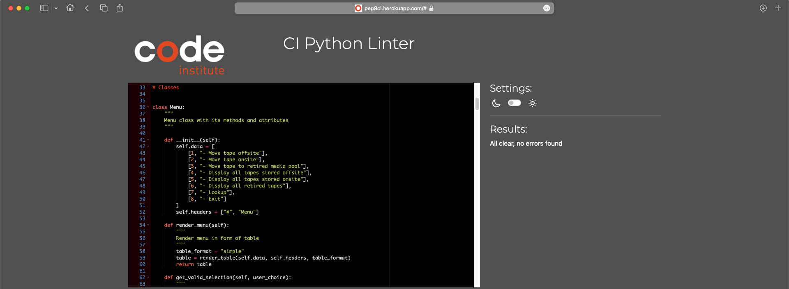

# The Tape Rotation Management System program was designed to manage and oversee the tape backup system for an IT department.
This program manages the rotation schedule for magnetic tape media. Tapes are stored both internally (onsite) and externally (offsite). When a tape reaches the end of its operational lifespan, it's retired from service. Backup tapes are crucial for recording recovery data for various systems like BRMS on IBM AS400, and they're utilised on a DAILY, WEEKLY, and MONTHLY basis.

To streamline this process, the program integrates with Google Spreadsheets to track tape locations and numbers effectively. 

Additionally, as an interesting note, the system's graphical interface has been aesthetically tailored to resemble the appearance of the 'IBM i' system, which is strongly associated with LTO tape technology.
 
[Try me here](https://tape-rotation-app-5fb3d76223d4.herokuapp.com/) - Google Chrome appears to be the optimal choice for testing the system in action.

 

## How to use the program:
 
When executing the program, users will encounter a menu presenting numbered options from 1 to 8, each linked to a specific action or command. To execute a desired action, users must input the corresponding number. For instance, to display a list of all tapes stored offsite, users should input number 4. If choosing options 1, 2, or 3 from the menu, users will be prompted to provide a specific tape number. Additionally, when a new tape number is recognised in the system, the user will also need to specify the tape type upon its initial entry into the media pool.

## Use cases

### Move tape offsite
  
### Move tape onsite
  
### Move tape to retired pool
 
### Lookup
  

## Flowchart

## Features
### Move tape offsite

When a tape number is provided, the program first verifies whether the tape is already located offsite by cross-referencing offsite records. Subsequently, it checks onsite records for the requested tape number. If a match is found, the tape is transferred offsite. Additionally, the program checks the retired media pool for the requested tape; if found, it notifies the user that the move is disallowed and advises moving the tape onsite first, as only onsite tapes can be relocated offsite.

If the provided tape number doesn't correspond to any records in the system, the program displays a message stating that the provided tape number is not part of the tape set. Furthermore, it prompts the user to initially move the new tape to the 'Onsite' location, recognising it as a new entry.
 

 
### Move tape onsite (and add new tape)

This command follows the same principles as command 1, facilitating the transfer of tapes from the offsite to the onsite section. In the event of no record found in the default first approach, it extends the search to retired tapes and proceeds with the move upon user request.

Furthermore, this command serves the dual purpose of adding a new tape to the system. Upon entering a tape number not currently recorded within the system, the program suggests adding the tape and presents a selection of tape types for the user to choose from. This information is essential for the initial entry of a new tape, as it requires detailed assignment during this stage.
 

 
### Move tape to retired media pool

To move a tape to the retired media pool, this command follows a process similar to commands 1 and 2, focusing on relocating the tape specifically to the retired media pool. Upon selecting this option from the menu, the program verifies predefined rules to ensure that only tapes stored onsite can be retired. If a tape is found offsite (as this search will also be conducted), the program notifies the user that only onsite tapes can be moved to the retired media pool. Additionally, this command can identify new tapes and provide prompts accordingly with appropriate suggestions.

 
### Display all tapes stored offsite

When selecting this action, the program will display a table presenting the tape number, tape type, and the last movement date for all tapes stored offsite.

 
### Display all tapes stored onsite

Similar to command 4, this action prompts the program to display a comprehensive list of all tapes stored onsite.
 
 
 
### Display all retired tapes

Once more, this command functions similarly to commands 4 and 5, displaying all retired tapes.

### Lookup

This command will locate the tape and display its current location along with all relevant details, including 'tape number', 'tape type', and 'date in'.
 

 
### Exit

The Exit option provides users the ability to terminate the program upon request. Additionally, prompts are integrated during the use of various commands. Upon completing a task, the program asks the user, 'Would you like to continue [y/n]?'. If the user responds with 'n', it performs the same action as the Exit menu option, leading to the termination of the program.

## Future features

- **Tape Quantity Tracking:** Implement functionality to track the quantity of specific tapes moved offsite and provide suggestions for future orders accordingly.
  
- **Email Notification System:** Develop an email notification system to automatically send requests to the media vault storage company based on the quantity suggestions mentioned above.

## Deployment

Following these steps will ensure a smooth deployment process for your application on Heroku.

1. Login to Heroku: Visit [Heroku Dashboard](https://dashboard.heroku.com/) and log in with your credentials.
   

2. Create a Heroku App: Click on the "New" button, then select "Create new app". Enter a unique name for your app, and Heroku will automatically generate a URL for accessing it.
   
3. Configure Environment Variables: Navigate to your app's settings on the Heroku dashboard. Under the "Config Vars" section, you can add key-value pairs for your environment variables, such as API keys or database URLs.
   

4. Add Buildpacks: In the "Settings" tab of your Heroku app, locate the "Buildpacks" section. Click on "Add buildpack" and enter the URLs for the required buildpacks, such as heroku/python and heroku/nodejs, based on your project's requirements.
   

5. Deploy Your Application: In the "Deploy" tab of your Heroku app, you have few options to deploy your application manually or connect it to a GitHub repository for automatic deployments. Choose the method that suits your workflow best. If opting for automatic deployments, configure the settings to deploy from the specified GitHub repository whenever changes are pushed.

## Data model

The data model for the Tape Rotation Management System comprises several key components:

### Tape Information
- Tape Number: Unique identifier for each tape.
- Tape Type: Categorisation of the tape based on its specifications or usage.
- Date In: The date when the tape was last moved or entered into the system.
  
### Tape Locations
- Onsite Storage: Records the tapes currently stored within the internal (onsite) location.
- Offsite Storage: Keeps track of tapes stored externally (offsite) for backup purposes.
- Retired Media Pool: Holds information about tapes that have reached the end of their operational lifespan and are retired from service.
  
### Google Spreadsheets Integration
- [Google Sheet Link](https://docs.google.com/spreadsheets/d/1DCKEwYfNOcrl9lJ57sxbSGCr3LO5y_avhHUmWs_ei3E/edit#gid=1419699616): The link to the Google Spreadsheet acting as the backend repository for all tape data.
  
## Testing
Love Sandwiches - Safari did not work

### Manual testing 

I tested the program on various popular browsers, including Google Chrome, Microsoft Edge, Firefox, Opera, Brave, and Safari. The program behaves as expected with one caveat: it hangs immediately after launch on the Safari browser. However, it's worth noting that similar behaviour was observed in the Code Institute's Love Sandwiches project, indicating that this deployment may not be compatible with Safari.

Throughout my code design process, I adopted an incremental approach to project development. I wrote small chunks of code that I immediately tested and uploaded to GitHub. It seems that this was a prudent approach because I didn't encounter any significant logical or semantic errors in the code. Most of the errors were related to missing trailing white spaces and exceeding the maximum character limit per line.
One of the more serious and interesting errors I noticed and documented was: 'TypeError': missing 1 required positional argument: 'tape'. It took me some time to find a solution, and in reality, the problem turned out to be trivial - I forgot to use the 'self' keyword when declaring a class method.

Below is a snippet:

### Validation testing 

The Python code has been validated using the [pep8ci](https://pep8ci.herokuapp.com/) validator deployed on Heroku by Code Institute.

During the initial testing cycle, there were over 50 errors and recommendations, primarily related to trailing white spaces and exceeding the maximum character limit per line.
I addressed most of these issues using [pylint](https://pypi.org/project/pylint/) and [autopop8](https://pypi.org/project/autopep8/) Python modules. Upon revalidation on [pep8ci](https://pep8ci.herokuapp.com/), I was able to narrow down the remaining issues to 4, all of which were promptly fixed.

Here are some snippets:

## Creds

- Conde Institute study content 
- Anna Greaves tutorial - https://www.youtube.com/watch?v=lPTKUiafTRY&t=2s
- Understanding Use-Case: https://www.youtube.com/watch?v=a3v4-KmDbQA
- Tabulate - https://medium.com/@HeCanThink/tabulate-your-go-to-solution-for-stylish-tables-in-python-35ede5145e28
- Console color: https://gist.github.com/kamito/704813
- Delay code execution - https://docs.python.org/3/library/time.html#time.sleep
- Sytem exit - https://docs.python.org/3/library/sys.html#sys.exit
- ChatGPT - helpful in providing translation assistance and explaining code snippets
- Pylint -  https://pypi.org/project/pylint/
- Autopop8 - https://pypi.org/project/autopep8/